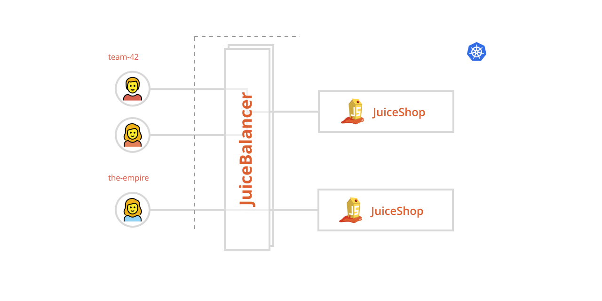

Running CTFs or Security Trainings with OWASP Juice Shop by creating a seperate Juice Shop instance for every participant / team. Juicy CTF mainly consists of a custom load balancer (dubbed "JuiceBalancer"), which identifies the user by a cookie and sending their traffic further along to the correct Juice Shop instance. If a user registers newly the JuiceBalancer will spin up a new Juice Shop Instance using the kubernetes api.



## Installation

```sh
helm install ...
```

### Deinstallation

```sh
helm delete ...
# Also delete all Juice Shop Deployments
kubectl delete deployment --selector app=juice-shop && kubectl delete service --selector app=juice-shop
```

## FAQ

### Why a custom LoadBalancer?

There are some special requirements which we didn't find to be easily solved with any prebuild load balancer:

- Restricting the number of users for a deployment to only the members of a certain team.
- The load balancers cookie must be save and not easy to spoof to access another instance.
- Handling starting of new instances.

If you have awesome ideas on how to overcome these issues without a custom load balancer, please write us, we'd love to hear from you!

### Why a seperate kubernetes deployment for every team?

There are some pretty good reasons for this:

- The ability delete the instances of a team separatly. Scaling down safely, without removing instances of active teams, is really tricky with a scaled deployment. You can only choose the desired scale not which pods to keep and which to throw away.
- To ensure that pods are still properly associated with teams after a pod gets recreated. This is a non problem with separate deployment and really hard with scaled deployments.
- The ability to embed the teamname in the deployment name. This seems like a stupid reason but make debugging SOOO much easier, with just using `kubectl`.

### Did somebody acutally ask any of these questions?

No 😉
