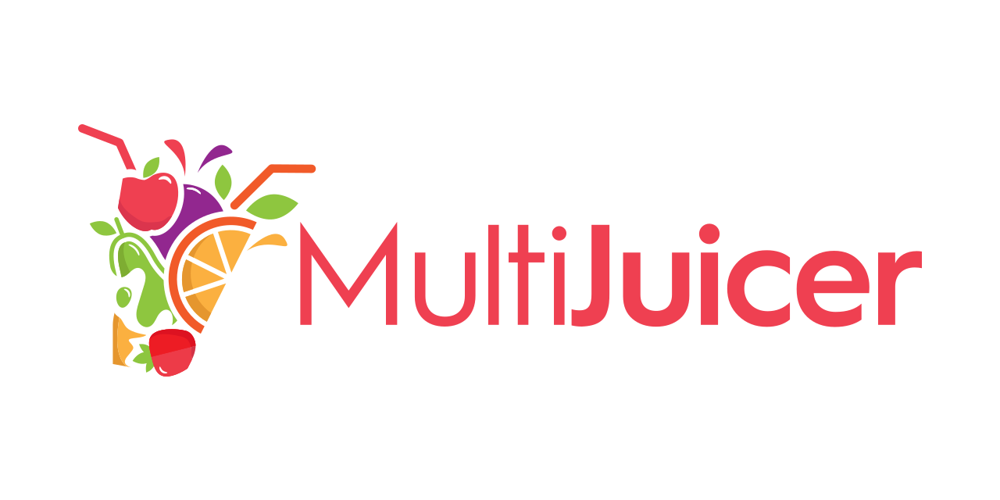

Running CTFs or Security Trainings with OWASP Juice Shop by creating a seperate Juice Shop instance for every participant / team. Juicy CTF mainly consists of acustom loadbalancer identifing the user by a cookie and sending the traffic further along to the correct Juice Shop instance.

## Instalation

```sh
helm install ...
```

### Deinstalation

```sh
helm delete ...
# Also delete all Juice Shop Deployments
kubectl delete deployment --selector app=juice-shop && kubectl delete service --selector app=juice-shop
```

## FAQ

### Why a custom LoadBalancer?

There are some special requirements which we didnt find easily solved by a prebuild load balancer:

- Restricting the numbers of users of a deployment to only the members of a certain team.
- LoadBalancer cookie must be save and not easy to spoof to access another instance.
- Handling starting of new instances.

If you have awesome ideas on how to overcome these issues without a custom load balancer, please write use, we'd love to here from you!

### Why a seperate kubernetes deployment for every team?

There are some pretty good reasons for this:

- The ability delete the instances of a team separatly. Scaling down safely, without removing instances of active teams, is really tricky with a scled deployment. You can only choose the desired scale not which pods to keep and which to throw away.
- To ensure that pods are still properly associated with teams after a pod gets recreated. This is a non problem with separate deployment and really hard with scaled deployments.
- The ability to embed the teamname in the deployment name. This seems like a stupid reason but make debugging SOOO much easier, with just using `kubectl`.

### Did sombody acutally ask any of the questons?

No 😉
